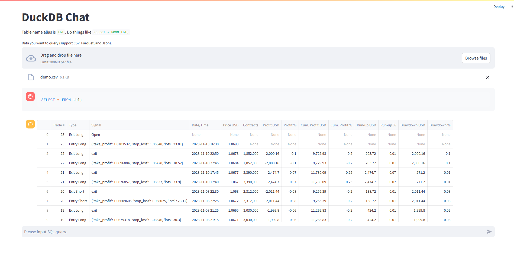

# DuckDB Chat

Access file as a database with interactive SQL query experience.

## Getting Started



```bash
pip install -r requirements.txt
```

```bash
streamlit run app.py
```

## Resources

### DuckDB

- [Python API - DuckDB](https://duckdb.org/docs/api/python/overview)

### Streamlit

- [Build a basic LLM chat app - Streamlit Docs](https://docs.streamlit.io/knowledge-base/tutorials/build-conversational-apps)
- [Chat elements - Streamlit Docs](https://docs.streamlit.io/library/api-reference/chat)
